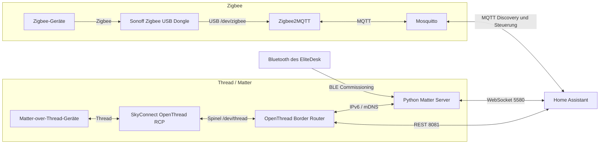

# Zigbee-, Thread- und Matter-Stack für Home Assistant Container

## Einordnung

Diese Dokumentation beschreibt den aktuell funktionierenden Smart-Home-Funkstack auf dem HP EliteDesk Docker-Host.

Home Assistant läuft als Container. Zigbee und Thread werden über zwei getrennte USB-Funkkoordinatoren bereitgestellt. Matter-over-Thread-Geräte werden über einen eigenständig betriebenen OpenThread Border Router und Python Matter Server in Home Assistant eingebunden.

Der Betrieb des Matter Servers als separater Docker-Container ist eine fortgeschrittene und von Home Assistant nicht offiziell unterstützte Installationsvariante. Sie funktioniert im dokumentierten Setup, erfordert jedoch eigenständige Pflege und Fehlersuche.

---

## Ziel

- bestehende Zigbee-Geräte weiterhin nutzen
- Zigbee und Thread parallel betreiben
- den vorhandenen SkyConnect nachhaltig weiterverwenden
- Matter-over-Thread-Geräte lokal und ohne Hersteller-Hub einbinden
- Home Assistant weiterhin als Docker-Container betreiben
- reproduzierbare Diagnose- und Wiederherstellungswege dokumentieren

---

## Aktueller Stand

- Zigbee-Koordinator: Sonoff Zigbee 3.0 USB Dongle Plus
- Zigbee-Software: Zigbee2MQTT
- MQTT-Broker: Eclipse Mosquitto
- Thread-RCP: Home Assistant SkyConnect / Connect ZBT-1
- Thread Border Router: OpenThread Border Router
- Matter-Controller: Python Matter Server
- Home Assistant: Container mit `network_mode: host`
- Infrastruktur-Interface: `eno1`
- Thread-Interface: `wpan0`
- Matter-Server-Port: `5580`
- OTBR-REST-Port: `8081`
- lokales Bluetooth: `hci0`
- erfolgreich provisioniertes Testgerät: Aqara Door and Window Sensor P2

---

## Architektur



---

## Zentrale Designentscheidung

Zigbee und Thread verwenden jeweils einen eigenen Funkadapter:

| Protokoll | Adapter | Zuständiger Dienst |
|---|---|---|
| Zigbee | Sonoff Zigbee 3.0 USB Dongle Plus | Zigbee2MQTT |
| Thread | SkyConnect mit OpenThread-RCP-Firmware | OTBR |
| Matter | kein eigener Funkadapter | Python Matter Server über IP und BLE |

Diese Trennung vermeidet Multiprotokoll-Abhängigkeiten und macht die Zuständigkeiten eindeutig.

---

## Relevante Pfade

```text
/opt/docker/homeassistant/
├── compose.yml
├── zigbee2mqtt/
│   └── data/
│       └── configuration.yaml
├── mosquitto/
│   ├── config/
│   ├── data/
│   └── log/
├── otbr/
│   └── data/
└── matter/
    ├── data/
    └── commission-thread-device.sh
```

---

## Stabile USB-Pfade

Dynamische Gerätenamen wie `/dev/ttyUSB0` und `/dev/ttyUSB1` können sich nach einem Neustart ändern.

Daher werden auf dem Host die stabilen Pfade unter `/dev/serial/by-id/` verwendet und im Container auf feste, lesbare Gerätenamen gemappt:

```yaml
devices:
  - /dev/serial/by-id/<SONOFF_BY_ID>:/dev/zigbee
```

```yaml
devices:
  - /dev/serial/by-id/<SKYCONNECT_BY_ID>:/dev/thread
```

Prüfung:

```bash
ls -l /dev/serial/by-id/
```

---

## Docker-Compose

Ein bereinigtes Beispiel befindet sich unter:

[`examples/compose.zigbee-thread-matter.yml`](../../examples/compose.zigbee-thread-matter.yml)

### Zigbee2MQTT

```yaml
zigbee2mqtt:
  image: koenkk/zigbee2mqtt:latest
  container_name: zigbee2mqtt
  restart: unless-stopped
  network_mode: host
  volumes:
    - /opt/docker/homeassistant/zigbee2mqtt/data:/app/data
  devices:
    - /dev/serial/by-id/<SONOFF_BY_ID>:/dev/zigbee
  environment:
    TZ: Europe/Berlin
```

Die zugehörige Konfiguration verwendet:

```yaml
serial:
  port: /dev/zigbee
  adapter: zstack
```

### Mosquitto

```yaml
mosquitto:
  image: eclipse-mosquitto:latest
  container_name: mosquitto
  restart: unless-stopped
  network_mode: host
  volumes:
    - /opt/docker/homeassistant/mosquitto/config:/mosquitto/config
    - /opt/docker/homeassistant/mosquitto/data:/mosquitto/data
    - /opt/docker/homeassistant/mosquitto/log:/mosquitto/log
```

Zigbee2MQTT enthält keinen eingebetteten MQTT-Broker. Ein externer Broker ist erforderlich.

### OpenThread Border Router

```yaml
otbr:
  image: openthread/border-router:latest
  container_name: otbr
  restart: unless-stopped
  network_mode: host
  privileged: true
  cap_add:
    - NET_ADMIN
    - SYS_ADMIN
  devices:
    - /dev/serial/by-id/<SKYCONNECT_BY_ID>:/dev/thread
    - /dev/net/tun:/dev/net/tun
  environment:
    OT_RCP_DEVICE: "spinel+hdlc+uart:///dev/thread?uart-baudrate=460800&uart-flow-control"
    OT_INFRA_IF: "eno1"
    OT_THREAD_IF: "wpan0"
    OT_LOG_LEVEL: "7"
    OT_VENDOR_NAME: "Nabu Casa"
    OT_VENDOR_MODEL: "SkyConnect"
  volumes:
    - /opt/docker/homeassistant/otbr/data:/data
```

Wichtig:

- Das aktuelle Image wertet `OT_RCP_DEVICE`, `OT_INFRA_IF` und `OT_THREAD_IF` aus.
- `OTBR_AGENT_OPTS` war im getesteten Image wirkungslos.
- Der SkyConnect verwendet im funktionierenden Setup `460800` Baud mit Hardware-Flow-Control.
- `network_mode: host` ist für IPv6, mDNS und die lokale REST-Anbindung relevant.

### Python Matter Server

```yaml
matter-server:
  image: ghcr.io/matter-js/python-matter-server:stable
  container_name: matter-server
  restart: unless-stopped
  network_mode: host
  depends_on:
    otbr:
      condition: service_started
  security_opt:
    - apparmor:unconfined
  volumes:
    - /opt/docker/homeassistant/matter/data:/data
    - /run/dbus:/run/dbus:ro
  command: >-
    --storage-path /data
    --paa-root-cert-dir /data/credentials
    --primary-interface eno1
    --bluetooth-adapter 0
    --port 5580
```

Wichtig:

- `service_healthy` darf nur verwendet werden, wenn OTBR auch einen Healthcheck besitzt.
- `--bluetooth-adapter 0` aktiviert serverseitiges BLE-Commissioning.
- `/run/dbus` stellt dem Container Zugriff auf BlueZ bereit.
- Der Server verwendet `eno1` für link-lokale IPv6-Kommunikation.

---

## Home-Assistant-Integrationen

### MQTT

Broker:

```text
Host: 127.0.0.1 oder IP des Docker-Hosts
Port: 1883
```

Wenn die Home-Assistant-Oberfläche Host und Port getrennt abfragt, wird im Host-Feld kein `mqtt://` eingetragen.

### OpenThread Border Router

REST-URL:

```text
http://127.0.0.1:8081
```

### Matter

WebSocket-URL:

```text
ws://127.0.0.1:5580/ws
```

### Thread

Nach dem Hinzufügen des OTBR erscheint der Border Router in der Thread-Integration. Das aktive Thread-Netzwerk muss ein bekanntes Dataset besitzen und als bevorzugtes Netzwerk markiert sein.

Das aktive Dataset ist ein Geheimnis und darf nicht ins Repository.

---

## Matter-over-Thread-Geräte provisionieren

### Standardweg

Home Assistant bevorzugt das Commissioning über die Companion-App auf einem regulären Android- oder iOS-Gerät.

### Dokumentierter Alternativweg

Im vorliegenden Setup schlug das mobile Commissioning unter GrapheneOS im vertraulichen Profil fehl. Die Google-Matter-Oberfläche meldete trotz bestehender WLAN-Verbindung „kein WLAN“.

Daher erfolgt das Commissioning direkt über den Matter Server und den Bluetooth-Adapter des EliteDesk:

```bash
cd /opt/docker/homeassistant/matter
./commission-thread-device.sh
```

Das Skript:

1. liest das aktive Thread-Dataset aus OTBR
2. fragt den Matter-Einrichtungscode verdeckt ab
3. hinterlegt das Dataset im Matter Server
4. startet `commission_with_code`
5. nutzt Bluetooth des EliteDesk zur Ersteinrichtung
6. überträgt die Thread-Zugangsdaten an das Gerät

Der numerische Code kann mit oder ohne Bindestriche eingegeben werden. Er wird nicht gespeichert.

---

## Betriebsprüfungen

### Container

```bash
docker ps --filter name=zigbee2mqtt
docker ps --filter name=mosquitto
docker ps --filter name=otbr
docker ps --filter name=matter-server
```

### Zigbee2MQTT

```bash
docker logs --tail=100 zigbee2mqtt
```

Erwartete Kernmeldungen:

```text
Connected to MQTT server
Coordinator firmware version
Zigbee2MQTT started
```

### Mosquitto

```bash
ss -ltnp | grep ':1883'
```

Test:

```bash
mosquitto_sub -h 127.0.0.1 -t test -v
mosquitto_pub -h 127.0.0.1 -t test -m hello
```

### OTBR

```bash
docker exec otbr ot-ctl state
docker exec otbr ot-ctl dataset active -x
curl -sS http://127.0.0.1:8081/node
```

Erwartet:

```text
leader
```

oder bei mehreren Border Routern ein anderer aktiver Thread-Zustand.

### Matter Server

```bash
ss -ltnp | grep ':5580'
docker logs --tail=100 matter-server
```

Erwartet:

```text
Matter Server successfully initialized
```

### Bluetooth

```bash
bluetoothctl show
rfkill list bluetooth
docker exec matter-server test -S /run/dbus/system_bus_socket
```

---

## Backup

Vor Änderungen sichern:

```bash
cd /opt/docker/homeassistant

sudo tar -czf \
  backup-zigbee-thread-matter-$(date +%F).tar.gz \
  zigbee2mqtt/data \
  mosquitto/config \
  otbr/data \
  matter/data \
  compose.yml
```

Das Backup enthält sensible Daten und darf nicht veröffentlicht werden.

---

## Sicherheits- und Hardening-Hinweise

- Mosquitto sollte langfristig nicht anonym im gesamten LAN betrieben werden.
- UFW-Regeln nur für tatsächlich benötigte Quellnetze öffnen.
- Die Zigbee2MQTT-Weboberfläche optional mit `auth_token` schützen.
- Thread-Dataset und Zigbee-Netzwerkschlüssel niemals committen.
- `privileged: true` bei OTBR dokumentiert den funktionierenden Ist-Zustand. Eine spätere Reduktion auf minimale Capabilities sollte separat getestet werden.
- Image-Tags wie `latest` erhöhen Aktualisierungsrisiken. Für einen stabilen Betrieb können getestete Versionen gepinnt werden.

---

## Verwandte Dokumentation

- [`../incidents/migration-zigbee-thread-matter.md`](../incidents/migration-zigbee-thread-matter.md)
- [`../troubleshooting/zigbee-thread-matter.md`](../troubleshooting/zigbee-thread-matter.md)
- [`../../scripts/matter/commission-thread-device.sh`](../../scripts/matter/commission-thread-device.sh)

---

## Referenzen

- [Home Assistant – Thread](https://www.home-assistant.io/integrations/thread/)
- [Home Assistant – Matter](https://www.home-assistant.io/integrations/matter/)
- [OpenThread Border Router – Docker](https://openthread.io/guides/border-router/build-docker)
- [Zigbee2MQTT – Docker](https://www.zigbee2mqtt.io/guide/installation/02_docker.html)
- [Zigbee2MQTT – Frontend](https://www.zigbee2mqtt.io/guide/configuration/frontend.html)
- [Zigbee2MQTT – zStack-Adapter](https://www.zigbee2mqtt.io/guide/adapters/zstack.html)
- [Python Matter Server – WebSocket API](https://github.com/home-assistant-libs/python-matter-server/blob/main/docs/websockets_api.md)
